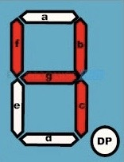

# 8 Bit Breadboard Computer

Starting from transistors, resistors, ICs, and other basic electronic components, I build a 8-bit computer on a breadboard! In this case, 8 bits means:

- The numbers used are at most 8-bits (0 to 255 if using positive integers only, -128 to 127 if using signed integers)
- The values stored in the RAM are 8 bits (but the addresses are 4 in length, which allows a total of 16 possible memory locations)
- The instructions excecuted by the computer are 8-bits long as well

There are two parts of this computer that needed to be programmed: The display module and the instruction decoder. To program them, I used EEPROMs (Electrically Erasable Programmable Read Only Memory), which I programmed with an Arduino Uno.

Here is a full description of the computer: https://morelt98.github.io/cv/electronics.html

* For the display module, the EEPROMs are programmed to take in a number in binary and return the corresponding decimal number on a seven segment display.
For example, if the number 00000100 , which is 4 in decimal, is passed in to the EEPROM, the return value will be 00110011, which is equivalent to 7 on the seven segment display, as follows:

                                        0     0     1     1     0     0     1     1

                                        dp    a     b     c     d     e     f     g
  

* For the instruction decoder, EEPROMs read the binary value of an instruction, and return a binary number representing the list of signals to turn on/off in order to excecute that instruction. For example, if the EEPROMs receives 01100000, which might mean "load the contents of the RAM at address 0000" (that interpretation is up to the designer/engineer), it will return 10110011, where the first "1" might be a signal that allows the RAM to output values, the second "1" might allow a register to receive values, etc.
